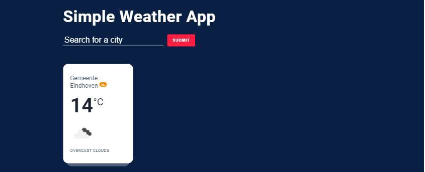

# Weather app

This project is created using Vite and React.
Vitest is used as test runner and React testing library is used for the unit tests

Instractions for running app:
- Clone app
- yarn install
- yarn start
- yarn test

Screenshots:

###########################################

This assignment gives us a good understanding about the thought-process and the capabilities of the developer. This
doesn’t have to be a rock-solid, highly scalable super fancy production-ready application, but just something that
allows us to get an idea of the developer's skills and level.

NOTE: This is a sample code and will only be used for evaluation purposes

## Requirements

Minimum things to do:

- Use git and make your project publicly available to us
- Make sure we can demo the project in 3 steps:
    - clone the project
    - install dependencies
    - (optional) start container(s)
- If we need to do anything to get it to work apart from the above 3 commands, make sure there is a ReadMe documenting
  these steps

Create a web app with the following:

- the current weather of location you entered in a search input box
- Should have validation for location entered in the search input box
- Should maintain the history of the location you searched for based on local storage

NOTE:

- You are free to _use any JS Framework_
- Not necessary to match UI (Your own idea is also welcome)
- To get the data for current weather use this api https://openweathermap.org/current
    - Sign up for an API key, they have a free plan available
- Code assessment is to test your frontend skills and your way of thinking

